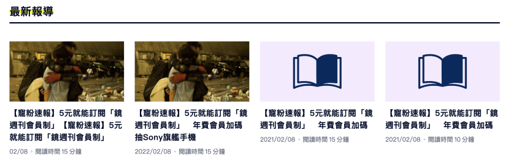

# Related-Report / 相關報導

## Feature

- 元件功能

  - 自動根據螢幕寬度 & 報導數量，調整報導排版形式。
  - 點按報導圖片 or 報導標題，可另開分頁至該報導頁面。

- 使用設計

  - 需傳入 `postData`，傳入相關報導資料 array。
  - 使用者可傳入 `header`，指定大標文字內容。
  - 使用者可傳入 `ariaLevel`，指定大標 (role=heading) 的 "aria-level"。
  - 使用者可傳入 `highlightColor`，指定大標 highlight 顏色 。
  - 使用者可傳入 `defaultImage`。當文章圖片無法正常顯示時，會改為顯示此 `defaultImage`。
  - 使用預設的 className : `.report-header`, `.report-title` 調整大標/報導標題樣式，或傳入自訂 className，並以該 className 進行調整。



## How to Use This Pkg as React Component ?

1. Install the npm [package](https://www.npmjs.com/package/@readr-media/react-component)
   `yarn add @readr-media/react-component`
2. Import component in the desired place

```
import { RelatedReport } from '@readr-media/react-component'

const data = [
  {
    id: 1,
    title: "文章標題 01",
    link: "https://www.readr.tw/post/2932",
    publishTime: "2023-02-08T07:00:00.000Z",
    readingTime: 100,
    heroImage: {
        id: "3",
        name: "記者來當外送員：開箱美食外送秘辛！",
        imageFile: null,
        urlOriginal: "",
        resized: {
          "original": "https://storage.googleapis.com/statics-readr-tw-dev/images/5f4cdbfe2f0f930023f79aab.記者來當外送員：開箱美食外送秘辛！.jpg",
          "w480": "https://storage.googleapis.com/statics-readr-tw-dev/images/5f4cdbfe2f0f930023f79aab-w480.記者來當外送員：開箱美食外送秘辛！.jpg",
          "w800": "https://storage.googleapis.com/statics-readr-tw-dev/images/5f4cdbfe2f0f930023f79aab-w800.記者來當外送員：開箱美食外送秘辛！.jpg",
          "w1200": "",
          "w1600": "https://storage.googleapis.com/statics-readr-tw-dev/images/5f4cdbfe2f0f930023f79aab-w1600.記者來當外送員：開箱美食外送秘辛！.jpg",
          "w2400": "https://storage.googleapis.com/statics-readr-tw-dev/images/5f4cdbfe2f0f930023f79aab-w2400.記者來當外送員：開箱美食外送秘辛！.jpg"
        }
      },
  }

]

export default function ComponentName() {
  return (
    <RelatedReport
      postData={reportsData}
      defaultImage="./imgs/default-post.svg"
      header="自訂大標"
      ariaLevel={2}
      headerClassName="自訂headerClassName"
      titleClassName="自訂titleClassName"
      highlightColor="red"
    />
  )
}
```

## Props

| 名稱            | 資料型別 | 必須 | 預設值            | 說明                                                                          |
| --------------- | -------- | ---- | ----------------- | ----------------------------------------------------------------------------- |
| postData        | Array    | `V`  | `[]`              | 報導資訊。[範例](#props-detail--postdata)                                     |
| header          | string   |      | `"最新報導"`      | 大標。                                                                        |
| ariaLevel       | number   |      | `undefined`       | 設定大標（role="heading"）的 aria-level，                                     |
| highlightColor  | string   |      | `"#ffffff"`       | 標題 highlight 顏色。                                                         |
| headerClassName | string   |      | `"report-header"` | 指定大標 className，可用於變更大標樣式。                                      |
| titleClassName  | string   |      | `"report-title"`  | 指定報導標題 className，可用於變更報導標題樣式。                              |
| defaultImage    | string   |      | `""`              | 報導的預設圖片路徑。當 `postData` 的 `images` 載入失敗時，則載入預設圖片。 |

## Props Detail : postData

### required

- `id`: 報導 id。

### optional

- `name`: 報導標題。
- `title`: 報導標題。 // alias to `name`
- `publishTime`: 報導發布日期。
- `readingTime`: 報導閱讀時間。
- `images`: 報導圖片。
- `link`: 報導連結。

## TODOs

- [ ] 建立 CI pipeline，透過 CI 產生 npm package，並且上傳至 npm registry
- [ ] 透過 Lerna 控制 packages 之間的版號
